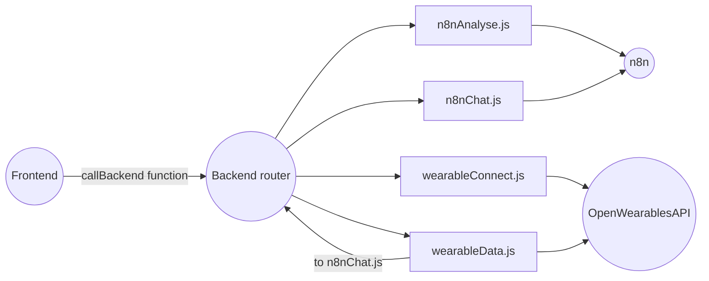
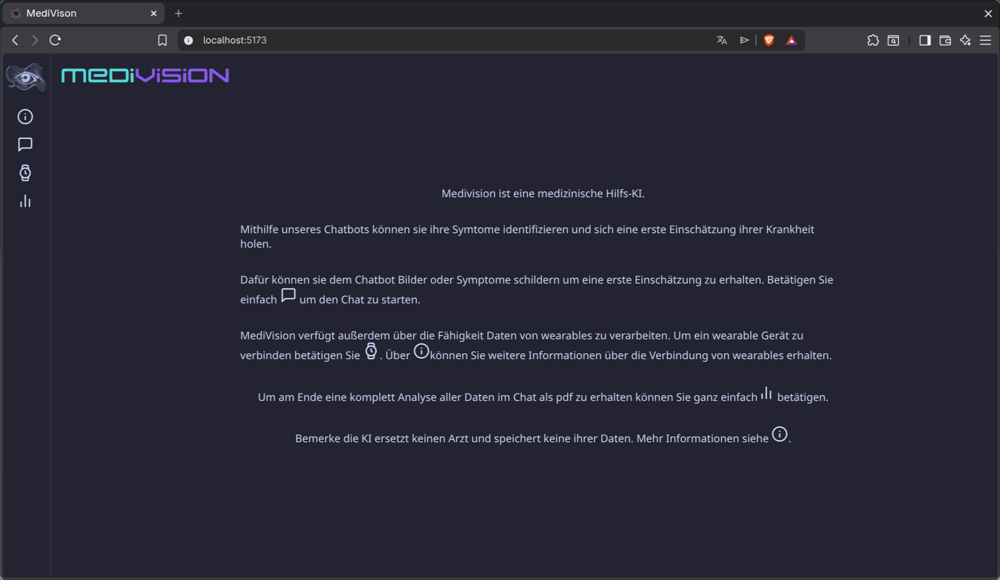
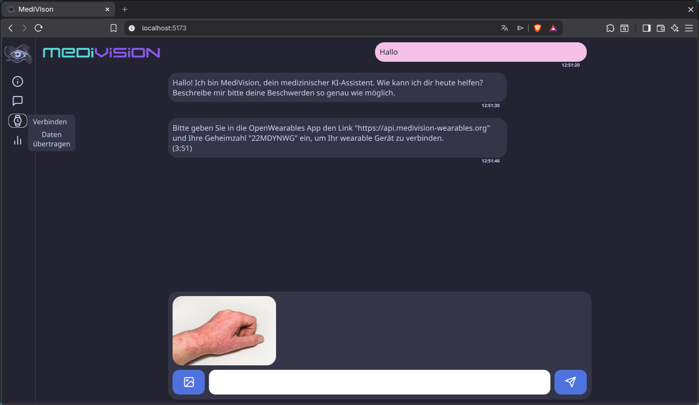
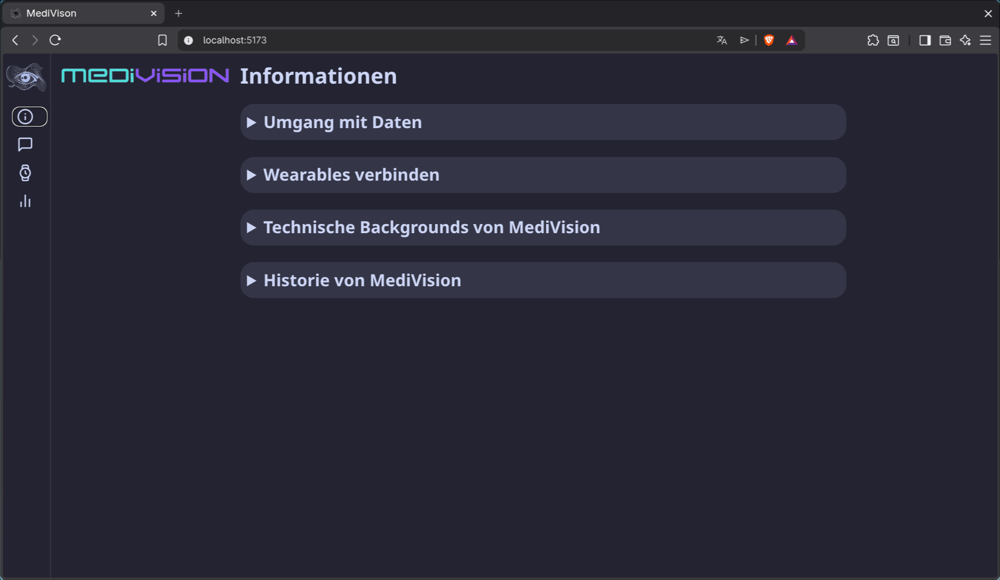
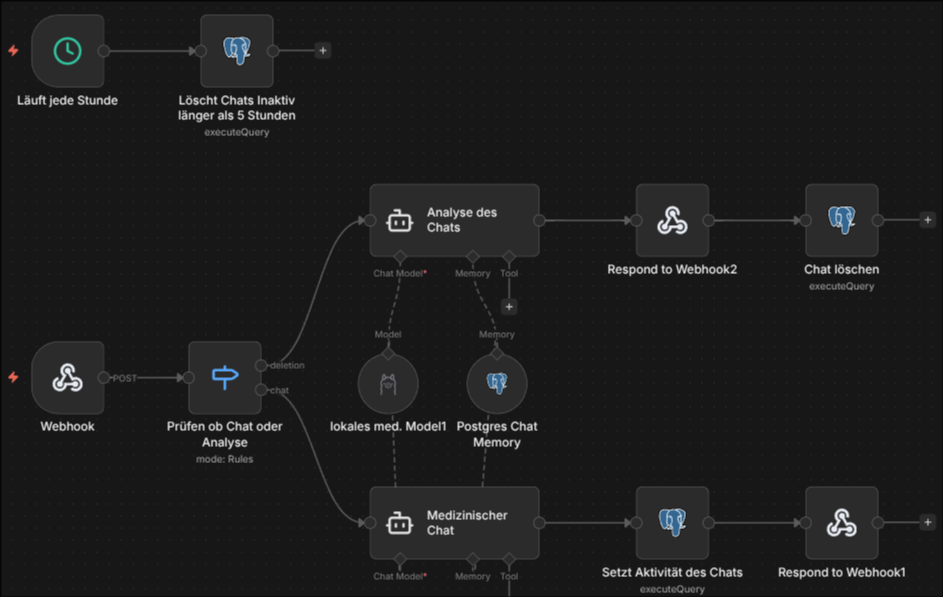

# MediVision

MediVision ist eine Fullstack-Webanwendung zur chatbasierten Analyse von Text-, Bild- und Wearable-Daten. Das Projekt kombiniert React im Frontend, ein Express Backend sowie externe Dienste: n8n und die OpenWearables API.

## Wie funktioniert es?

Das Frontend stellt die Chatoberfläche für den Nutzer bereit. Hier können Nachrichten mit oder ohne Bilder gesendet werden. Zusätzlich ist es möglich, Wearable Geräte zu verbinden und eine Analyse des gesamten Chatverlaufs inklusive einer ersten Einschätzung möglicher Krankheitsbilder generieren zu lassen.

Alle Anfragen werden über das Backend an externe Dienste wie n8n und die OpenWearables API weitergeleitet. Diese Dienste werden selbst gehostet. Sensible Daten wie API Keys oder Zugangsdaten sind ausschließlich im Backend gespeichert und sind für das Frontend nicht sichtbar.

n8n übernimmt die Kommunikation mit dem KI Modell und verarbeitet die eingehenden Daten. Die OpenWearables API wird für die Verbindung mit Wearable Geräten genutzt und stellt Gesundheitsdaten bereit. Diese Daten können zusätzlich zur Chatanalyse an n8n übermittelt und dort weiterverarbeitet werden.



## Webanwendung

**Startseite:**


**Chatseite:**


**Infoseite:**


## Workflow

**n8n Workflow**


Der Workflow für MediVision benötigt einen Webhook Eingang, um Nachrichten aus dem Frontend zu empfangen. Anschließend wird geprüft, ob es sich um eine normale Chatnachricht oder um eine vollständige Analyse des Chatverlaufs handelt.

Je nach Anfrage werden die gesendeten Daten verarbeitet und an das lokale KI Modell weitergeleitet. Dabei können neben Textnachrichten auch Bilder sowie optionale Wearable Daten einbezogen werden. Damit die KI den bisherigen Gesprächskontext berücksichtigen kann, werden Chatverläufe temporär in einer Postgres Datenbank gespeichert.

Nach der Verarbeitung sendet n8n die generierte Antwort oder Analyse wieder zurück an das Backend und anschließend an den Nutzer im Frontend.

Zusätzlich enthält der Workflow einen automatischen Bereinigungsprozess. Dieser läuft stündlich und löscht alle Chats, die länger als fünf Stunden inaktiv sind. Dadurch bleiben medizinische Daten nicht dauerhaft in der Datenbank gespeichert.

## Voraussetzungen

**Frontend/Backend**
- Node.js und npm
	- Abhängigkeiten werden durch ``npm install`` installiert

**n8n**
-   laufende n8n Instanz
-   funktionierender Workflow für Chat und Analyse
	- erreichbarer Webhook Endpoint

**OpenWearables API**
- Repo: https://github.com/the-momentum/open-wearables
- Basic OpenWearables setup
	- API KEY
	- erreichbare URL für API Port
- APP
	- IOS Testflight (OpenWearable Discord)
	- Android APK (OpenWearable Discord)

## Setup
1. **Klonen:**
   ```bash
   git clone https://github.com/colinhaase/MediVision.git
   cd MediVision
   ```
2.  **Backend installieren:**
	 ```bash
	 cd backend
	 npm install
     cd ..
	 ```
3.  **Frontend installieren:**
	 ```bash
	 cd medivision-react
	 npm install
     cd ..
	 ```
4. **Environment Variablen:**

   **Backend:**
   ```bash
   cp ./backend/.env.example ./backend/.env
   ```
   
   Dann Variablen eintragen:
   ```env
   #BACKEND
   PORT=port_of_backend

   #OPENWEARABLES
   API_URL=your_openwearables_url
   API_KEY=your_openwearables_api_key
   USERNAME=openwearables_admin_login 
   PASSWORD=openwearables_admin_login

   #N8N
   N8N_URL=your_n8n_webhook
   N8N_KEY=your_webhook_auth
   ```
	   
   **Frontend:**
   ```bash
   cp ./medivision-react/.env.example ./medivision-react/.env
   ```
   
   Dann Variablen eintragen:
   ```env
   #BACKEND
   VITE_BACKEND_URL=your_backend_url
   ```

## Anwendung starten

> [!IMPORTANT]
> **Voraussetzung**: Der n8n-Webhook sowie der API-Port von OpenWearables sind konfiguriert und öffentlich erreichbar.

	
**Backend:**
```bash
cd backend
npm start
cd ..
```

**Frontend:**
```bash
cd medivision-react
npm start
cd ..
```

   
## Nutzung/Lizenz

Dieses Projekt ist ausschließlich für schulische Zwecke bestimmt.  
  
Jegliche Nutzung, Vervielfältigung, Modifikation oder Veröffentlichung außerhalb dieses Kontextes ist ohne  Zustimmung der Autoren untersagt.  
  
Copyright © 2026 Colin Haase, Noah Peuker, Hendrik Mayhaus, David Menke und Fabian Otten
